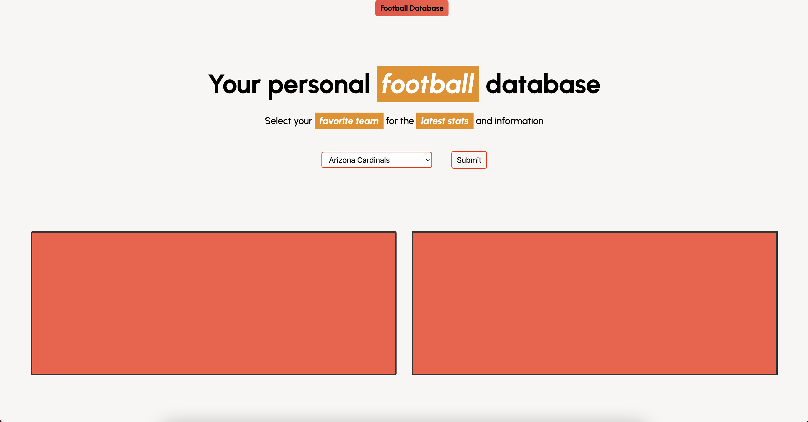

# project-one-team4
The application that we made is designed gives the user current NFL player information per request. It also gives you the selected team's current schedule.
The API’s that we have chosen for this app is API Sports, which gives information about players for a selected team. We have also added a Ticketmaster API, which gives the user-selected teams upcoming games. The CSS framework we used was Tailwind.
User Story: When I search for a team I want to see a list of players and games. When I search through players I want their stats and picture. When I see games I want to be able to buy tickets for them.

## Description

The application that we made is designed to give the user current NFL player information per request. It also gives you the selected team's current schedule.
The API’s that we have chosen for this app is API Sports, which gives information about players for a selected team. We have also added a Ticketmaster API, which gives the user-selected teams upcoming games. The CSS framework we used was Tailwind.
User Story: When I search for a team I want to see a list of players and games. When I search through players I want their stats and picture. When I see games I want to be able to buy tickets for them.

## Installation

No steps are required to install the project. The site is fully functional on arrival.

## Usage
To use the site, users will first select their favorite football team from the dropdown menu and press submit. This will then allow them to choose through a dropdown menu their favorite player from that team and see their picture with their player stats listed. When choosing an initial team from the menu, the user will also be given a list of games that they can click on the be redirected to TicketMaster for that specific game.

## Credits
https://github.com/colbyrobins
https://github.com/raythomass
https://github.com/GigaChimpus
https://github.com/LIONELM89
